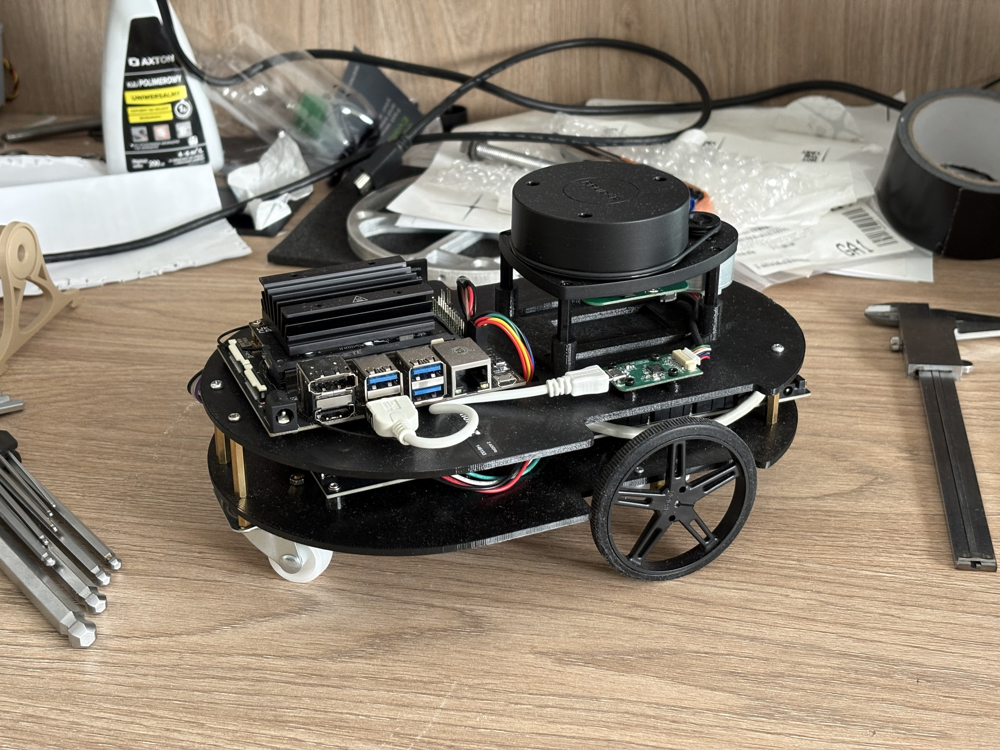
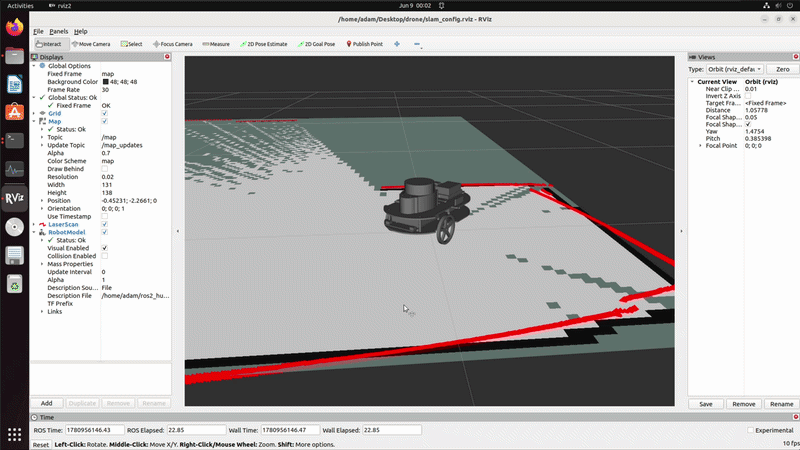
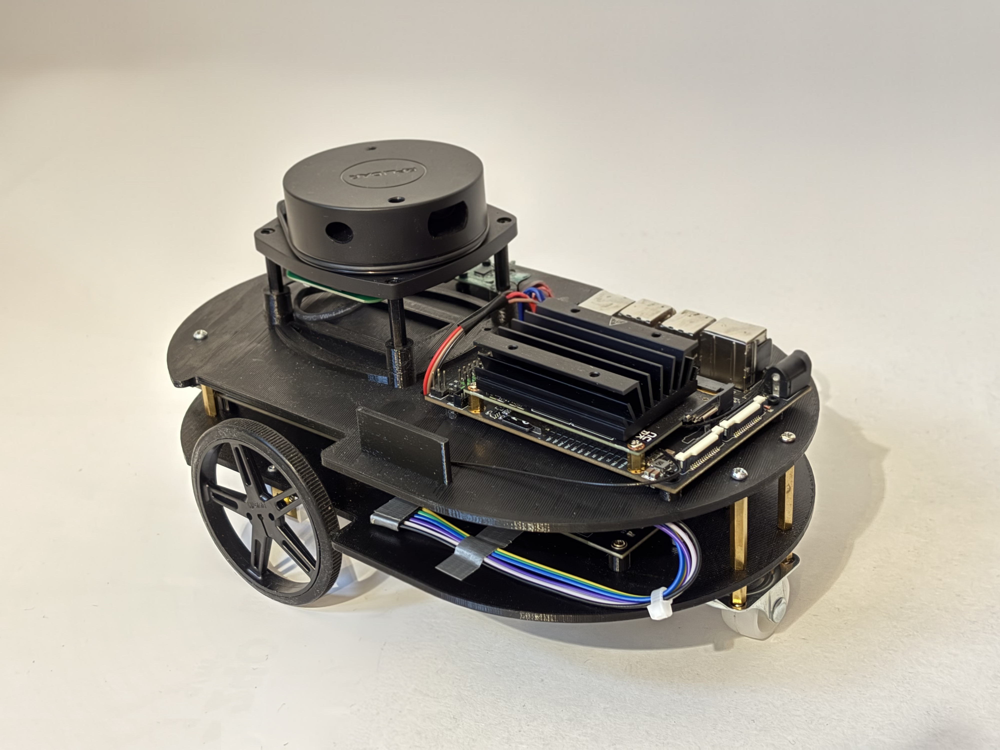
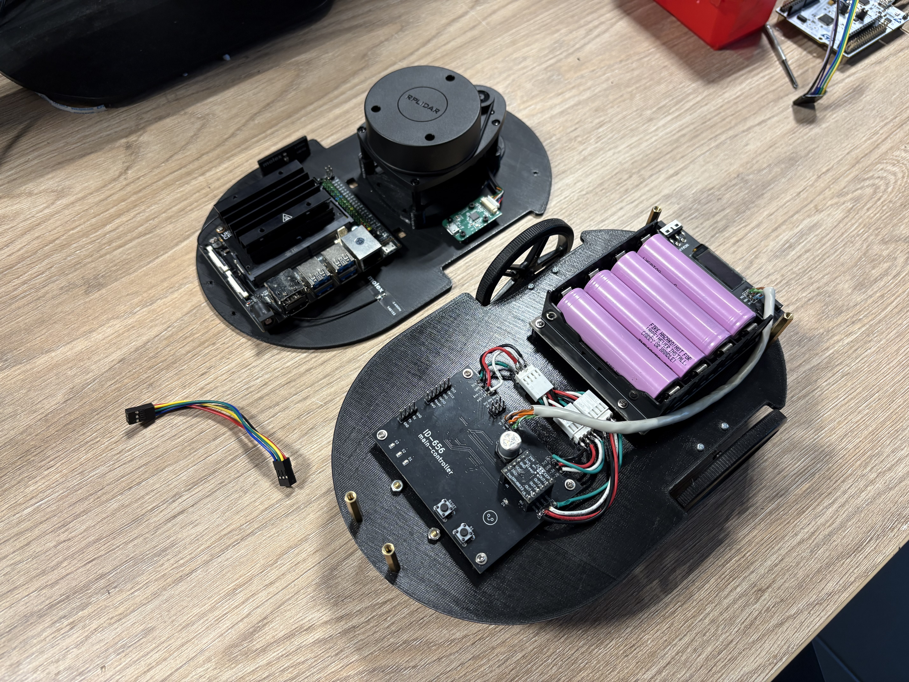
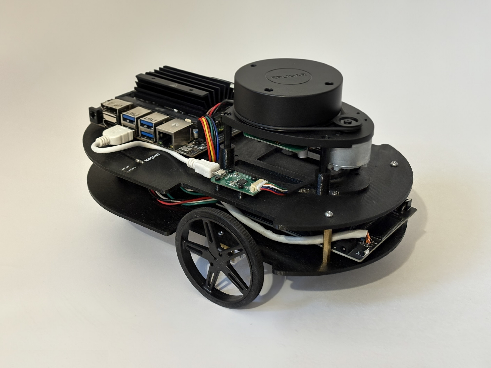
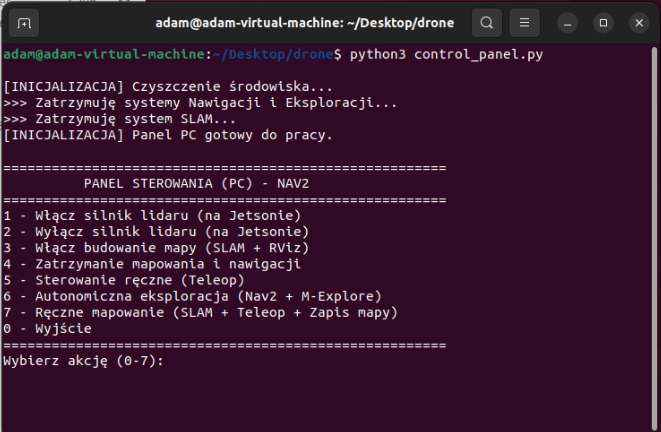

# Dron kołowy do autonomicznego mapowania terenu

Projekt autonomicznego robota mobilnego opartego na układzie różnicowym (differential drive). Projekt został zrealizowany we współpracy z [Zakładem Automatyki i Urządzeń Pomiarowych AREX Sp. z o.o](https://www.wbgroup.pl/arex/) w ramach Projektu Grupowego na Wydziale ETI Politechniki Gdańskiej.

    

---

Głównym zadaniem robota jest autonomiczna eksploracja nieznanych przestrzeni, budowanie map (SLAM) w czasie rzeczywistym oraz omijanie przeszkód, a także możliwość zdalnego sterowania i monitorowania parametrów telemetrycznych.

    

## 🛠️ Architektura Sprzętowa (Hardware)

System został podzielony na warstwę decyzyjną (High-Level) oraz wykonawczą (Low-Level).

### Jednostka Nadrzędna (High-Level)
* **Komputer:** Nvidia Jetson Nano
* **Zadania:** Przetwarzanie danych ze skanera laserowego, działanie systemu **ROS2 (Humble)** w środowisku Docker, planowanie trajektorii, algorytmy mapowania (SLAM) oraz komunikacja Wi-Fi ze stacją bazową.
* **Sensoryka:** RPlidar A1M8-R6 (skaner laserowy 2D o zasięgu do 12m, komunikacja USB-UART).

### Jednostka Wykonawcza (Low-Level)
* **Mikrokontroler:** STM32L476RG zamontowany na [autorskiej płycie głównej](https://github.com/adasbl/main-controller-pcb.git).
* **Zadania:** Bezpośrednia kontrola silników, sprzętowy regulator PI, akwizycja danych z enkoderów oraz wymiana ramek telemetrycznych z Jetsonem po magistrali UART.
* **Napęd:** Silniki DC 6V Pololu z przekładnią 298:1, sterownik silników DRV8833.
* **Sensoryka:** * Enkodery magnetyczne Pololu 3081 (12 impulsów na obrót).
  * IMU LSM6DSV16X (akcelerometr + żyroskop po I2C do korekcji orientacji).
* **Zasilanie:** Pakiet ogniw 18650 Li-Ion (3.6V) podłączony do modułu UPS Waveshare 18307, który stabilizuje napięcie do 5V (dla Jetsona) i 3.3V (dla logiki STM32).

    
    
    

---

## 🧠 Architektura Programowa (Software)

### ROS2 & Algorytmy Nawigacji (Jetson Nano)
Oprogramowanie wykorzystuje narzędzia systemu ROS2 do zarządzania węzłami.
* **Mapowanie (SLAM):** Tworzenie map w czasie rzeczywistym na podstawie odczytów z LiDARa oraz enkodometrii.
* **Nawigacja Globalna:** Autorska implementacja algorytmu **A*** (`a_star.py`) wykorzystująca heurystykę odległości Manhattan do wyznaczania najkrótszej ścieżki do celu lub integracja z planerem `GridBased` w Nav2.
* **Nawigacja Lokalna:** Algorytm **DWA (Dynamic Window Approach)** (`dwa.py`) lub `DWBLocalPlanner`, omijający dynamiczne przeszkody na bieżąco, z wbudowanym systemem wykrywania "utknięć" (stuck recovery).
* **Eksploracja:** System potrafi autonomicznie wyszukiwać najdalsze nieodkryte granice mapy (tzw. frontiers) i kierować tam robota (m.in. przy użyciu pakietu `explore_lite`).

### Low-Level Control (STM32)
* Napisany w języku C przy użyciu STM32CubeIDE.
* Komunikacja z Jetsonem odbywa się za pomocą asynchronicznych ramek UART o stałej długości 10 bajtów: `[0xAA, v_lin(float), v_ang(float), 0x55]`.
* Przelicza zadane prędkości na m/s na ticki enkoderów w cyklu 25 ms.

---

## 💻 Panel Sterowania PC

Do obsługi robota przygotowano dedykowany skrypt uruchamiany na stacji bazowej (`control_panel.py`), który pozwala zarządzać procesami robota przez sieć.

    

**Dostępne akcje:**
1. Włącz / Wyłącz silnik lidaru (na Jetsonie).
2. Budowanie mapy (SLAM + podgląd w RViz).
3. Sterowanie ręczne (Teleop z klawiatury).
4. **Autonomiczna eksploracja:** Uruchamia węzły Nav2 oraz M-Explore; robot samodzielnie jeździ po pomieszczeniu do momentu zmapowania całości. Zapisuje logi do folderu `logs/`.
5. Ręczne mapowanie z automatycznym zapisem mapy po zakończeniu jazd.
6. Zdalne wyłączenie (Shutdown) komputera Jetson.

---

## 📂 Struktura Repozytorium

Struktura plików opiera się na wydzieleniu logiki na poszczególne środowiska wykonawcze:

* `3Dmodels/` - Modele 3D:
  * `platform/` - Modele 3D ramy platformy robota.
  * `other/` - Pozostałe elementy drukowane.
* `code/` - Kod źródłowy i skrypty:
  * `ESP32/` - Oprogramowanie eksperymentalne dla układów ESP32.
  * `jetson/` - Węzły ROS2 i algorytmy dla Nvidia Jetson (m.in. `robot_navigation.py`, `a_star.py`, `dwa.py`, `nav2_params.yaml`, `control_panel.py`).
  * `STM32/` - Kod C dla mikrokontrolera (obsługa mostka H, enkodery, regulator PI).
  * `ros_simulation/` & `simulation/` - Środowiska do testów algorytmów (np. Gazebo).
* `datasheets/` - Noty katalogowe wykorzystanych podzespołów (np. DRV8833, LSM6DSV16X).
* `docs/` & `docsPG/` - Dokumentacja techniczna (DTP), listy komponentów, bilans mocy.
* `img/` - Zdjęcia projektu, renderów 3D oraz map.
* `pcb/` *(Submoduł)* - Pliki projektu KiCad (schematy i obwody drukowane) płyty głównej sterownika.
* `robot-setup/` *(Submoduł)* - Skrypty i konfiguracja początkowa środowiska Docker / Jetson.

---

## 🔗 Powiązane Repozytoria i Odnośniki

* [Oprogramowanie i instrukcja do obsługi robota (ROS2)](https://github.com/matrix1798/robot_sofware.git)
* [Repozytorium autorskiej płytki sterownika wykonawczego (KiCad)](https://github.com/adasbl/main-controller-pcb.git)

## 👥 Zespół Projektowy

* [Adam Błażejewski](https://github.com/adasbl) - Kierownik projektu / Elektronika / Kod STM32
* [Mateusz Kuczerowski](https://github.com/matrix1798) - Architektura ROS2 / Implementacja algorytmów na Jetsonie
* [Maciej Domeradzki](https://github.com/TofTo23) - Dokumentacja techniczna / Modele 3D
* [Krzysztof Toczyński](https://github.com/rolomixedmixed) - Architektura mechaniczna / Pomiary i testy
